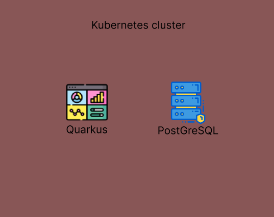

# INFO
- Sample project for testing quarkus functions and also to check out dependency injection
# Requirements 
1. Quarkus Framework: Use Quarkus for building the application.
2. Dependency Injection: Utilize CDI (Contexts and Dependency Injection) in Quarkus to manage beans.
3. Persistence: Use Panache with Hibernate ORM for data access.
4. REST Endpoints: Expose REST endpoints to manage books and authors.
5. Testing: Write unit and integration tests.
# Detailed
- For the Library Management System project, the following functionalities should be implemented to ensure a comprehensive and practical demonstration of dependency injection, RESTful APIs, and database interactions using Quarkus.
# Core Functionalities 
### Manage Authors
- Create Author: Add a new author to the library.
- Get All Authors: Retrieve a list of all authors.
- Get Author by ID: Retrieve details of a specific author by their ID.
- Update Author: Update the details of an existing author.
- Delete Author: Remove an author from the library.
- Manage Books
### Manage Books
- Create Book: Add a new book to the library, associating it with an author.
- Get All Books: Retrieve a list of all books.
- Get Book by ID: Retrieve details of a specific book by its ID.
- Update Book: Update the details of an existing book.
- Delete Book: Remove a book from the library.
# Additional Features
- Validation: Ensure proper validation for request bodies using annotations like @NotNull, @Size, etc.
- Error Handling: Implement global exception handling to return meaningful error messages.
- Pagination: For GET /authors and GET /books endpoints, implement pagination to handle large datasets.
- Sorting and Filtering: Allow sorting and filtering of authors and books based on different criteria (e.g., name, title).
# Dependencies
- JDBC Driver: PostgreSQL JDBC Driver.
- Hibernate ORM: For ORM capabilities with Panache.
- RESTEasy JAX-RS: For building RESTful web services.
- Quarkus Panache: Simplified ORM with Hibernate.
- Quarkus Arc: For dependency injection.
- Quarkus SmallRye OpenAPI: For API documentation.
- Quarkus JUnit5: For testing.
- Quarkus RESTEasy JSON-B: For JSON processing.
# Representation

# Configs for the application.properties
```
# DataSource configuration
quarkus.datasource.db-kind=postgresql
quarkus.datasource.username=your_db_username
quarkus.datasource.password=your_db_password
quarkus.datasource.jdbc.url=jdbc:postgresql://localhost:5432/your_db_name

# Hibernate ORM configuration
quarkus.hibernate-orm.database.generation=update

# Enable OpenAPI and Swagger UI
quarkus.swagger-ui.always-include=true
quarkus.smallrye-openapi.path=/openapi

# Remote Development configs
quarkus.package.jar.type=mutable-jar
quarkus.http.host=0.0.0.0
quarkus.live-reload.password=12341234
quarkus.live-reload.url=http://172.24.166.62:30000
quarkus.profile=dev
```
# Hot reload configs
- We should run the app in mvn `quarkus:remote-dev`
- We should pass the environment variable for making it run in dev mode
  ```
  - name: QUARKUS_LAUNCH_DEVMODE 
    value: "true"
  ```
- Also we should firstly use mvn package to create a maven run file so we can use that jar to run our app.. The yaml file for the kubernetes will be in [here](./kubernetes-config/)